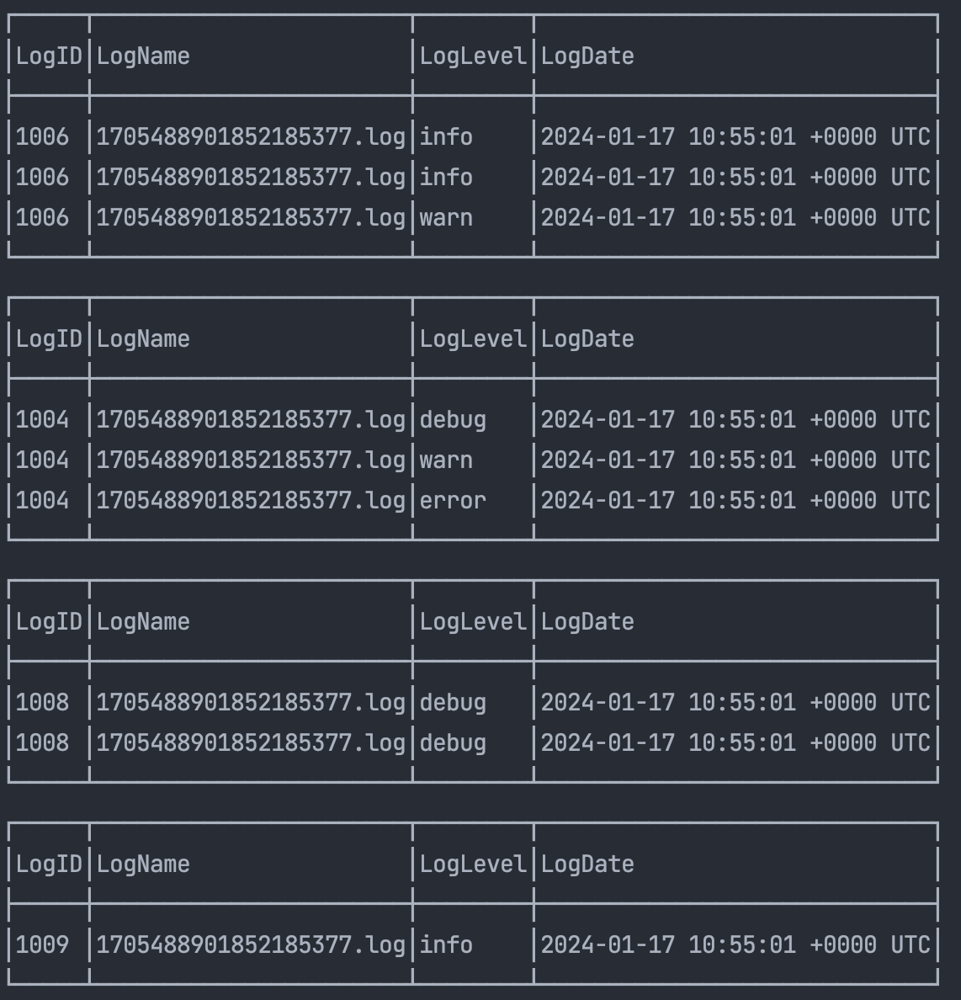

# Log Handler Service(TTY)

As a dummy best practice scenario, the Log Handler is a service designed to streamline the process of generating, parsing, and storing log data. 
It utilizes the `Cobra CLI` to create log files in the `./logs/` directory, parses the log content, and inserts 
the relevant data into the database. The service captures crucial information such as log file names, timestamps, 
log levels, and log messages.

## Options

- The details of log files are printed in the terminal STDOUT for easy monitoring.
- You can filter log details during the database insertion process. Modify the `LOG_LEVEL_CRITERIA` key in the `.env` file to your desired log level (options: trace, debug, info, warn, error, fatal).
- The log service is interactive, allowing you to run it through either `docker exec` inside the container or as a direct shell command.
- The `./logs` directory is a shared Docker volume, and log files are accessible in the project root path by running the provided commands.
- The key `SEEDER_LOG_COUNTER` obtains the count of the seeder-generating file.
- The key `RUNNER_WORKER_COUNT` obtains the count of workers of logger runner to speed up or manage resources.

### Quick Start

- Build and run images and containers:

```shell
make run
```

- Accessing to the Logger container:

```shell
make log
```

- Stop the docker containers:

```shell
make down
```

- Run the below command in the Logger container:

### Commands
**(execute in docker container after the above `make log` command)**

- To seed and generate log files:

```shell
./logger logs:seed
```

- To count generated log files:

```shell
ls ./logs | wc -l
```

- To parse, read, and insert into the database:

```shell
./logger logs:run
```

##### The Terminal STDOUT Snapshot


